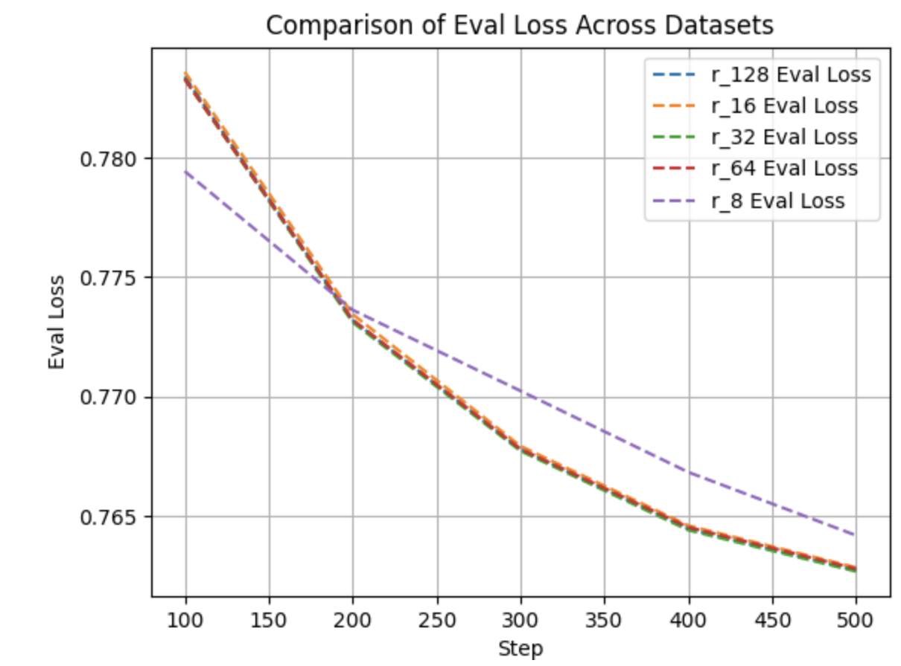
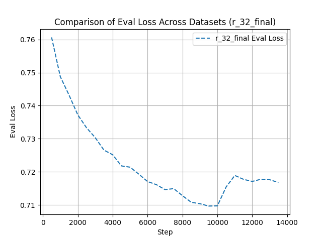

# Lab 2: Scalable Machine Learning

**Implementation:**
- **Training Notebook:** `FelixValter_Llama_3_2_1B+3B_Conversational_+_2x_faster_finetuning.ipynb`
- **UI Script:** `app.py`

---

## Task 1: Fine-Tune a Pre-Trained Large Language Model and Build a Serverless UI

### First Steps
1. Create a free account on [Hugging Face](https://huggingface.co).
2. Create a free account on [Google Colab](https://colab.google.com).

### Objectives
1. Fine-tune an existing pre-trained large language model on the FineTome Instruction Dataset.
2. Build and deploy an inference pipeline with a Gradio UI on Hugging Face Spaces.

**Relevant Links:**
- Dataset and code: [GitHub Repository](https://github.com/felixfritzen/ScalableMLlab2)
- Deployed UI: [Hugging Face Space](https://huggingface.co/spaces/felixfritzen/ScalableMLlab2)

---

## Task 2: Improve Model Performance and Fine-Tune Multiple LLMs

### README.md Requirements
Describe ways to improve model performance using:
- **Model-Centric Approaches:** 
  We are using a LoRA adapter to finetune the model because it is cheaper than a fc layer. A fc layer would be represented by a 1000x1000 matrix therefore = 1M parameters, however a LoRA adapter of rank 8 would be represented by two matrices 1000x8 and 8x1000 therefore 16K parameters and 500 times less than fc layer. Note that the product is still [1000x8] @[8x1000]=[1000,1000]. Therefore the most impactful hyperparameter is this bottleneck, the rank which is 8 in  this case. Therefore we will do a hyperparameter search of the rank in powers of 2, e.g 8,16,32,64. We will do a grid here, we could also do a search of the learning rate and decay, here we would do a random search and not a grid. However due to the limited scope we choose to just do the hyperparameter search of the rank.

  **Chosen approach:**
  - Perform a hyperparameter grid search for rank values (e.g., 8, 16, 32, 64).

- **Data-Centric Approaches:**
  More data can have a large impact, the dataset given in the task is a subset of a 10 times larger dataset that could be used. However, more data means  more computation and more time. However quality is also important, using large amount of low quality data can be worse than low amount of good data. We could have some function that looks at the data before training and removes low quality.

**Base Model:**
Llama-3.2-3B-Instruct was chosen for final deployment based on evaluation loss.

---

### Fine-Tuning Details
We chose to implement model-centric approach. 
To test what rank r is optimal we do the following:
1. Split the data 80-20, 80% is kept as a training data, 20% is used as validation data 
2. We use the validation data to monitor the performance of our model throughout training. Performance is defined as validation loss.
3. The parameters of the model that performs the best on the validation data are then the parameters that we use in our final model.
4. Due to the extensive training time we limit the search of the optimal rank r to only 500 steps per rank. We realize that this is on the low side but since we perform continuous validation multiple times throughout training it isn’t feasible from a time standpoint to use more steps

Below we show the validation results for the 5 different specifications of hyperparameters r:

**Validation Results:**
The difference is small between the different hyperparameter settings but r=32 shows a slightly smaller evaluation loss after 500 steps so we use r=32 for our final model.
- Best hyperparameter setting: Rank `r=32`, with the lowest evaluation loss after 500 steps.

---

### Exploring Open-Source Foundation LLMs
1. Experimented with different open-source foundation models.
2. To mitigate CPU inference limitations, used GPU resources on Hugging Face for optimal performance.

The main hyperparameter approach will be model centric but we start with some data-centric to test out different pre quantized model as the base.

Llama-3.2-3B-Instruct:
Prompt:
Rank the 10 largest cities in the world according to population ranked in descending order

Answer:
Here are the 10 largest cities in the world according to their population, ranked in descending order, based on the latest available data:

1. Tokyo, Japan - 38,140,000
2. Delhi, India - 29,280,000
3. Shanghai, China - 24,167,000
4. Mumbai, India - 21,380,000
5. Sao Paulo, Brazil - 22,042,000
6. Mexico City, Mexico - 21,804,000
7. Osaka, Japan - 21,688,000
8. Kolkata, India - 18,784,000
9. Dhaka, Bangladesh - 20,034,000
10. Buenos Aires, Argentina - 16,627,000

Note that these numbers represent the population of the urban agglomeration (the city and its surrounding metropolitan area) rather than the city proper.

Prompt:
Write me three sentences on how the U.S was founded

Answer:
1. The United States was founded on July 4, 1776, when the Declaration of Independence was adopted by the Continental Congress. 

2. This historic document declared the 13 American colonies' independence from Great Britain and established the principles of individual liberty and the power of the people to govern themselves. 

3. The Declaration was drafted by a committee consisting of Thomas Jefferson, John Adams, Benjamin Franklin, Robert Livingston, and Roger Sherman.

Prompt:
What can a student that takes a course in scalable machine learning expect to learn?

Answer:
When a student takes a course in scalable machine learning, they can expect to gain knowledge on the following aspects:

1. Introduction to the fundamentals of machine learning, including supervised and unsupervised learning, regression, classification, clustering, dimensionality reduction, and model selection.
2. Understanding the challenges and complexities of implementing these machine learning models in a large-scale setting, such as dealing with large datasets, managing computational resources, and optimizing algorithms for performance.
3. Learning techniques for parallelizing and distributing computation, including distributed computing frameworks like Apache Spark, Hadoop, or GPU acceleration.
4. Understanding how to design and implement large-scale machine learning pipelines that can handle data streaming or real-time predictions.
5. Knowledge of data preprocessing and feature engineering techniques that can be applied at scale to ensure high-quality data and feature relevance for machine learning models.
6. Familiarity with emerging technologies and advancements in machine learning that enable scalability, such as distributed deep learning frameworks like TensorFlow and PyTorch, model pruning, and knowledge graph-based methods.
7. Learning how to design and evaluate large-scale machine learning models with complex interactions and feedback loops, which may include ensemble learning, stacking, or combining multiple models to improve performance.
8. Understanding the importance of quality

Llama-3.2-1B-Instruct-bnb-4bit

Prompt:
Rank the 10 largest cities in the world according to population

Answer:
1. Tokyo, Japan: population 38,140,000
2. Delhi, India: population 29,000,000
3. Shanghai, China: population 20,240,000
4. Sao Paulo, Brazil: population 21,180,000
5. Moscow, Russia: population 12,710,000
6. Mexico City, Mexico: population 21,180,000
7. Istanbul, Turkey: population 14,840,000
8. Seoul, South Korea: population 11,800,000
9. Bengaluru, India: population 12,700,000
10. Nairobi, Kenya: population 6,700,000

These cities have the largest populations in the world, based on the latest available estimates.

Prompt:
Write me three sentences on how the US was founded
Answer:
Here are three sentences on how the United States was founded:

The United States was founded by 13 original states, all of which had been colonized from European countries such as England, France, and Britain, during the American Revolution, which ended in 1783. The American Revolution was sparked by tensions over taxes and representation in the British government, and resulted in the creation of the Declaration of Independence and the subsequent establishment of a sovereign government in the colonies. In 1776, the Declaration of Independence, signed by representatives of the thirteen original colonies, formally declared the colonies free from British rule and established the United States of America.
Prompt:
What can a student that takes a course in scalable machine learning expect to learn?
Answer:
A student taking a course in scalable machine learning should expect to learn about data preprocessing techniques that handle missing values, data normalization, feature selection and dimensionality reduction to minimize the number of features, regularization techniques such as L1 and L2, and techniques for handling the complexities and noise inherent in real-world data, such as handling missing values, outliers, and anomalies in the data.
In addition to these technical knowledge areas, students learning to do scalable machine learning should also be able to understand how these techniques can be implemented in Python and how to write effective code. Additionally, the course should emphasize how these concepts and techniques are used to develop models that are optimized for efficiency and accuracy, as well as how to test, validate, and improve the performance of these models in real-world scenarios.
The course should also focus on the applications of scalable machine learning in industries such as business and healthcare. For instance, machine learning can be used to automate customer service, diagnose health problems, and predict market trends, among other applications.
Finally, the course should emphasize the importance of developing strong computational skills in Python and other programming languages, and how to build on these skills to create effective models that meet business or organizational needs.

As we can see there is no notable difference, nevertheless we decide to go with the 3B model

---
### Performance of the final model on the validation set
We show the performance of the model with r=32 and Llama-3.2-3B-Instruct below. The validation loss is plotted every 500 step during the training process. In total we trained the model for 13500 steps or 1.35 epochs.

---

### Fine-Tuning Framework
- Framework used: **Unsloth** for fine-tuning.

---

## Deliverables
1. Source code: [GitHub Repository](https://github.com/felixfritzen/ScalableMLlab2).
2. README.md file with performance improvement descriptions. [Readmee](https://github.com/felixfritzen/ScalableMLlab2/blob/main/README.md)
3. Publicly accessible UI: [Hugging Face Space](https://huggingface.co/spaces/felixfritzen/ScalableMLlab2).
